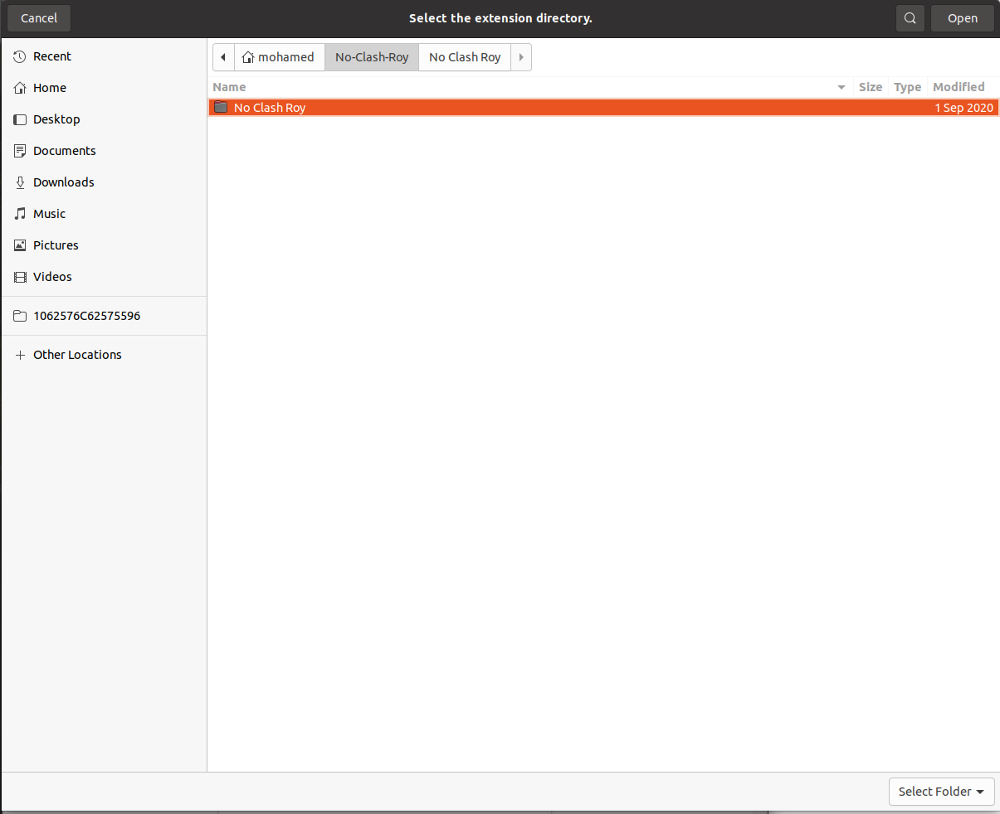

# No-Clash-Roy
My first practice with chrome extensions. Script to remind myself not to consume too much Clash Royale content whenever I open YT homepage. 

You can customize this extension to target any URL you want and to make alerts in different contexts. To try it out, clone and unzip the package and then follow the instructions to load an unpacked chrome extension: 

1. Open the Extension Management page by navigating to
   
   	
   
   - The Extension Management page can also be opened by clicking on the Chrome menu, hovering over More Tools then selecting Extensions
   
2. Enable Developer Mode by clicking the toggle switch next to Developer mode

   

3. Click the Load unpacked button and select the extension directory

   

4. The extension has been successfully installed!

   

